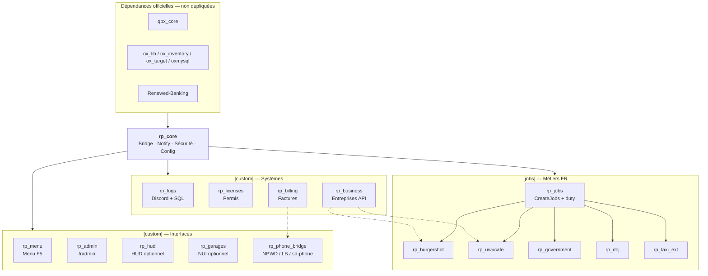

# Visuel — Scripts custom `rp_*`

## Inventaire (16 ressources)

### `[custom]` — socle & interfaces

| Script | Rôle | Obligatoire |
|--------|------|-------------|
| **rp_core** | Bridge Qbox, notify, argent/items, rate-limit | Oui |
| **rp_logs** | Logs SQL + webhooks Discord | Oui |
| **rp_licenses** | Permis auto/moto/camion/bateau/avion/armes | Oui |
| **rp_billing** | Factures joueur & entreprise + API | Oui |
| **rp_business** | Comptes, coffres, annonces, historique | Oui |
| **rp_menu** | Menu joueur ox_lib (`F5`) | Oui |
| **rp_admin** | Admin ACE (`/radmin`) | Oui |
| **rp_phone_bridge** | Pont NPWD / LB Phone / sd-phone | Oui |
| **rp_hud** | HUD NUI moderne | Optionnel* |
| **rp_garages** | Garages NUI FR | Optionnel* |

\*Si activés : stopper `qbx_hud` / `qbx_garages` pour éviter les doublons.

### `[jobs]` — métiers ajoutés

| Script | Rôle |
|--------|------|
| **rp_jobs** | Enregistre Burgershot, UwU, Gouvernement, DOJ + duty |
| **rp_burgershot** | Points service / coffre Burger Shot |
| **rp_uwucafe** | Points service / coffre UwU Café |
| **rp_government** | Points service / coffre Gouvernement |
| **rp_doj** | Points service / coffre DOJ |
| **rp_taxi_ext** | Extension FR autour de `qbx_taxijob` |

### Déjà fourni par Qbox (pas recréé)

Police · EMS · Mécano · Taxi · Inventaire · Core joueur · Propriétés · Clés véhicules
