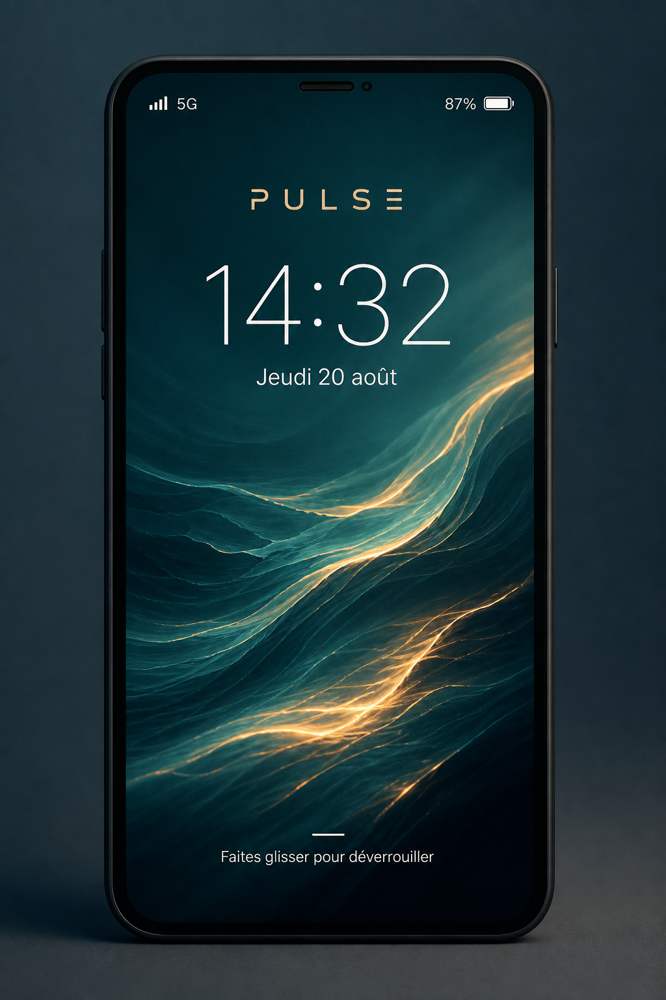
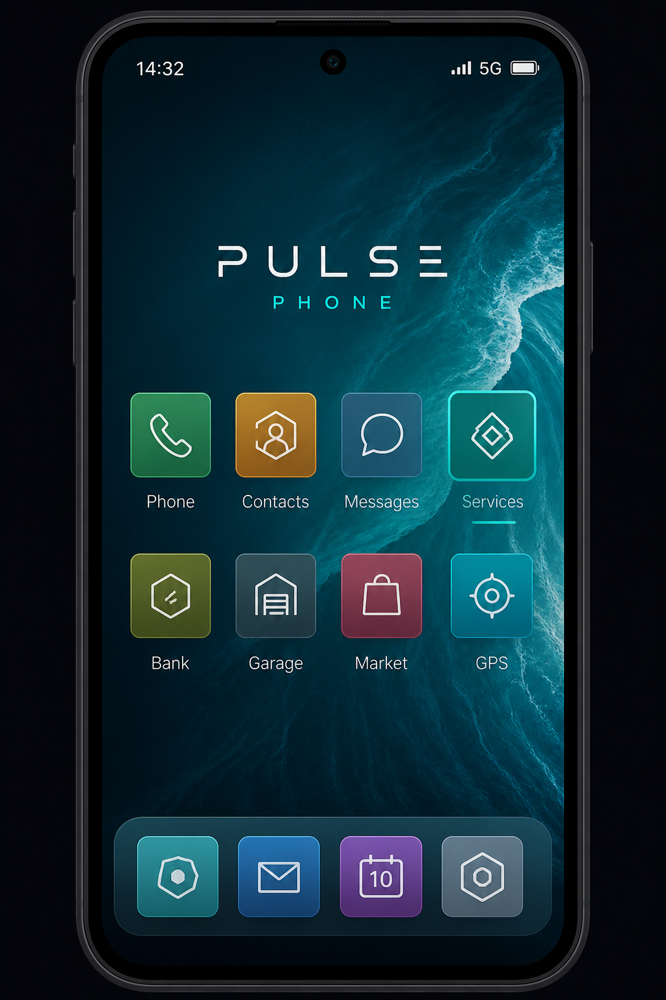

# Pulse Phone

Téléphone RP **original** pour serveurs **Qbox**.  
Stack : `qbx_core` · `ox_lib` · `ox_inventory` · `oxmysql` · `pma-voice` · React/TypeScript/Vite.

> Ce projet n’est **pas** une copie de LB Phone ni d’un autre téléphone commercial. Interface, code et assets sont originaux.

## État actuel (v0.1 — fondation)

| Module | Statut |
|--------|--------|
| Architecture / config / SQL | OK |
| Open/close + lock/home + drag | OK |
| Services (liste + détail + hooks serveur) | Fondation |
| Contacts / Messages / Appels | API serveur + stubs NUI |
| Banque / Garage / Market / GPS | Prochaines étapes |

## Installation rapide

Voir [INSTALL.md](./INSTALL.md).

```bash
# 1. Copier la ressource
ensure pulse-phone

# 2. Importer sql/install.sql

# 3. Builder l’UI
cd pulse-phone/web && npm install && npm run build
```

## Documentation

- [ARCHITECTURE.md](./docs/ARCHITECTURE.md)
- [INSTALL.md](./INSTALL.md)
- [CONFIG.md](./CONFIG.md)
- [API.md](./API.md)

## Preview

Lock screen · Home screen (identité visuelle Pulse — teal / ocean)




